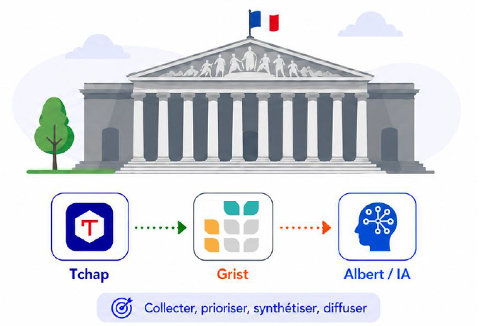

### Nom du défi

Veille parlementaire souveraine

### Description courte

Chaque utilisateur décrit ses sujets d'intérêt dans Grist
(mot-clé, parlementaire, dossier) et reçoit chaque matin
sur Tchap un digest sourcé des travaux de l'Assemblée généré par Albert,
priorisé par un reranker. Le système suit ensuite le
devenir des documents détectés (amendement adopté, rejeté).

### Porteur

Clément Gras

### Description longue

Les outils de veille parlementaire existent, mais ils sont privés, coûteux
et opaques. Ce défi démontre qu'une veille ciblée, explicable et
personnalisable se construit entièrement sur l'open data de l'Assemblée
nationale et les briques souveraines de la suite numérique de l'État :
Grist pour la configuration et les résultats, l'API Tricoteuses pour la
recherche, Albert API pour la synthèse, Tchap pour la diffusion, Onyxia
pour l'hébergement.

Trois partis pris :

1. **No-code côté utilisateur.** Créer une veille, exclure des termes,
   consulter les résultats : tout se fait dans Grist, sans développeur.
2. **Explicabilité native.** Chaque alerte cite l'extrait du document qui
   la justifie ; la synthèse d'Albert n'est qu'un chapeau de lecture, elle
   ne remplace jamais la citation.
3. **Garantie de rappel.** La recherche plein texte server-side de l'API
   Tricoteuses est le seul moteur de matching : pas de pipeline local à
   maintenir, un appel par veille suffit.

Déroulé : vendredi, pipeline complet sur les amendements (recherche
Tricoteuses par veille, écriture Grist, premier digest Tchap synthétisé
par Albert en soirée) ; samedi, polissage et restitution — l'ajout d'une
veille en direct dans Grist, un run, le digest qui tombe dans Tchap.

### Image principale

### Contributeurs

- Lucien Mirlicourtois
- Cédric Allain

### Ressources utilisées

- [ ] `openfisca-france-parameters` — Base de données de paramètres ✺ OpenFisca
- [ ] `an-dossiers-legislatifs` — Dossiers législatifs de l'Assemblée nationale (législature courante) ✺ Assemblée nationale
- [ ] `an-amendements-xvii` — Amendements déposés à l'Assemblée nationale (législature actuelle) ✺ Assemblée nationale
- [ ] `an-comptes-rendus` — Comptes rendus de la séance publique à l'Assemblée nationale (législature actuelle) ✺ Assemblée nationale
- [ ] `an-votes-xvii` — Votes des députés (législature actuelle) ✺ Assemblée nationale
- [ ] `an-deputes-en-exercice` — Députés en exercice ✺ Assemblée nationale
- [ ] `an-deputes-historique` — Historique des députés ✺ Assemblée nationale
- [ ] `an-deputes-senateurs-ministres-par-legislature` — Députés, sénateurs et ministres d'une législature ✺ Assemblée nationale
- [ ] `an-agenda-reunions` — Agenda des réunions à l'Assemblée nationale (législature courante) ✺ Assemblée nationale
- [ ] `an-questions-gouvernement` — Questions de l'Assemblée nationale au Gouvernement ✺ Assemblée nationale
- [ ] `an-questions-gouvernement-ecrites` — Questions écrites de l'Assemblée nationale au Gouvernement ✺ Assemblée nationale
- [ ] `an-questions-gouvernement-orales` — Questions orales de l'Assemblée nationale au Gouvernement ✺ Assemblée nationale
- [ ] `premier-ministre-legi` — Codes, lois et règlements consolidés ✺ Premier ministre
- [ ] `premier-ministre-dole` — Dossiers législatifs Légifrance ✺ Premier ministre
- [ ] `premier-ministre-jorf` — Édition ''Lois et décrets'' du Journal officiel ✺ Premier ministre
- [ ] `senat-dispositifs-textes` — Dispositifs des textes déposés ou adoptés au Sénat ✺ Sénat
- [ ] `senat-dossiers-legislatifs` — Dossiers législatifs du Sénat ✺ Sénat
- [ ] `senat-amendements` — Amendements déposés au Sénat ✺ Sénat
- [ ] `senat-senateurs` — Sénateurs ✺ Sénat
- [ ] `senat-questions-gouvernement` — Questions orales et écrites du Sénat au Gouvernement ✺ Sénat
- [ ] `senat-comptes-rendus` — Comptes rendus de la séance publique au Sénat ✺ Sénat
- [ ] `an-et-co-database-regroupement-toutes-donnees` — Base de données unifiée Parlement / Législation / Service Public ✺ Assemblée nationale & communauté
- [ ] `an-et-co-serveur-mcp-regroupement-toutes-donnees` — Serveur MCP  - Accès unifié Parlement / Législation / Service Public ✺ Assemblée nationale & communauté
- [ ] `an-et-co-api-regroupement-toutes-donnees` — API - Accès unifié Parlement / Législation / Service Public ✺ Assemblée nationale & communauté
- [X] `legiwatch-api-parlement` — API Parlement ✺ LegiWatch
- [ ] `legiwatch-database-parlement` — Base de données Parlement ✺ LegiWatch
- [ ] `legiwatch-serveur-mcp-parlement` — Serveur MCP Parlement ✺ LegiWatch

### Galerie

### Documents

### URL de démonstration

### Diapositives de présentation

[Diapositives de présentation](docs/diapositives.pdf)
